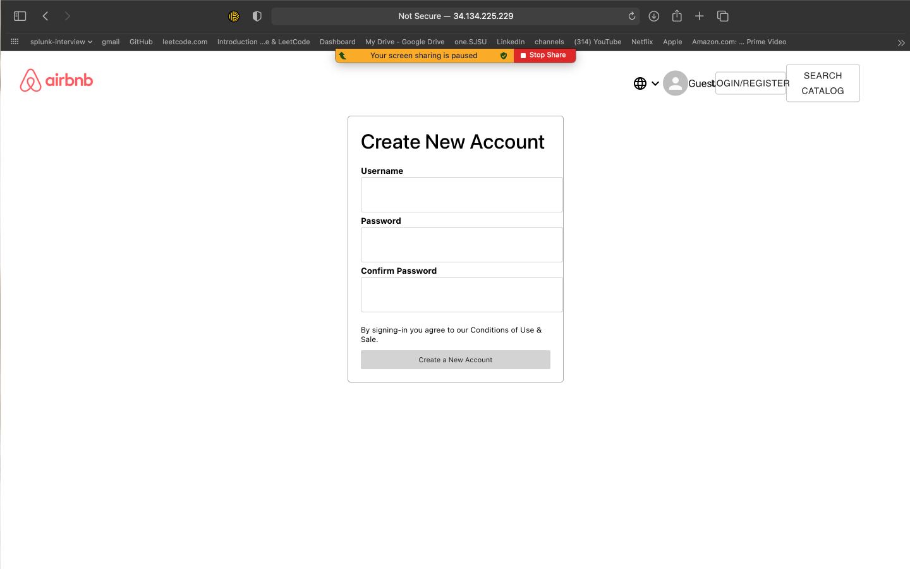
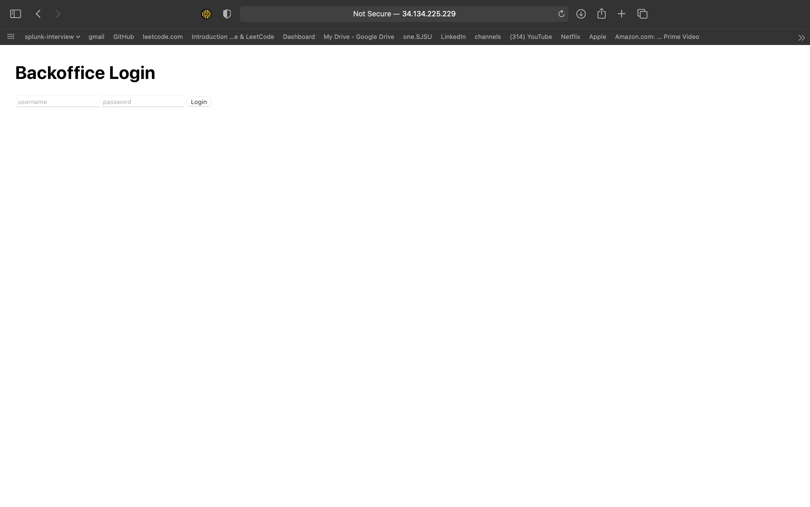
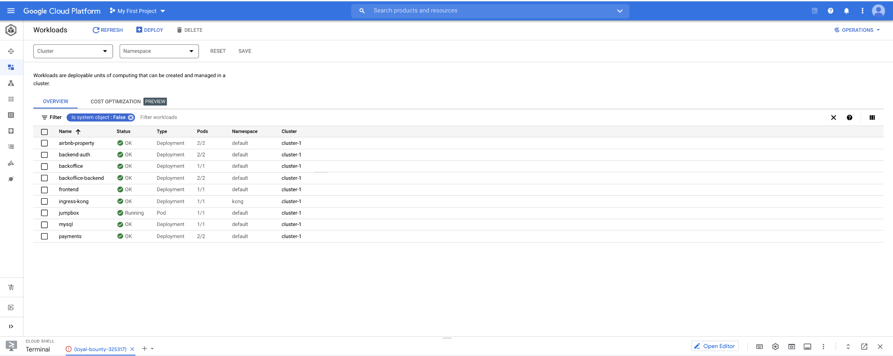
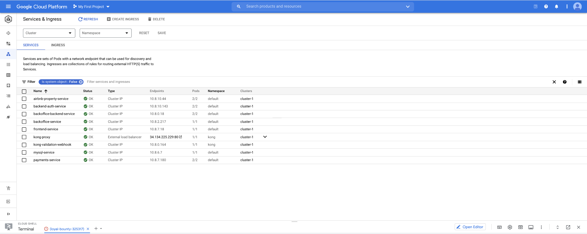
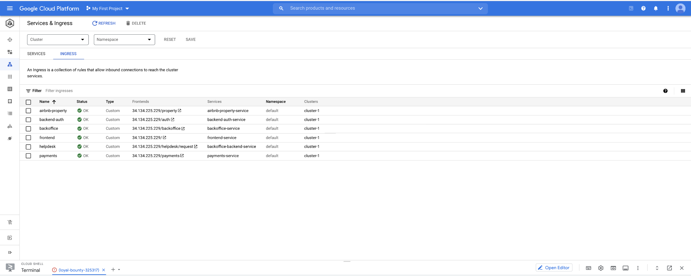
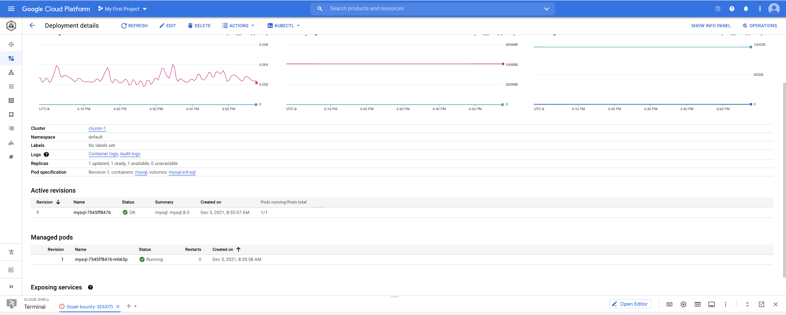

# AirBnb Clone with Google Kubernetes Engine (GKE) hosted on Google Cloud Platform (GCP)

## Overview

Google Cloud Hosted Enterprise Application for an AirBnb Clone(without booking / date features). This project is a full-stack application that replicates key functionalities of Airbnb, including property listings, user authentication, booking, and payment processing. It is built using microservices architecture.

## Table of Contents

- [Introduction](#introduction)
- [Project Architecture](#project-architecture)
- [Monorepo Structure](#monorepo-structure)
- [Technologies Used](#technologies-used)
- [Services Overview](#services-overview)
  - [Authentication Service](#authentication-service)
  - [Property Service](#property-service)
  - [Payment Service](#payment-service)
  - [Back-Office Backend](#back-office-backend)
  - [Back-Office Frontend](#back-office-frontend)
  - [Frontend Application](#frontend-application)
- [Getting Started](#getting-started)
  - [Prerequisites](#prerequisites)
  - [Installation](#installation)
  - [Running the Application Locally](#running-the-application-locally)
- [Deployment](#deployment)
  - [Docker Containers](#docker-containers)
  - [Kubernetes (GKE)](#kubernetes-gke)
- [Demo](#demo)

## Introduction

This project aims to provide a comprehensive Airbnb clone that demonstrates the use of modern technologies and best practices in software development. It utilizes microservices architecture, RESTful APIs, and containerization to ensure scalability, maintainability, and ease of deployment.

## Project Architecture


The application is divided into several microservices, each responsible for a specific domain:

- **Authentication Service**: Manages user registration and authentication using JWT.
- **Property Service**: Handles property listings and related operations.
- **Payment Service**: Processes payments using CyberSource API.
- **Back-Office Application**: Provides support and administration functionalities.
- **Frontend Application**: User interface for customers to interact with the platform.

## Monorepo Structure

The project is organized as a monorepo with the following structure:

```
airbnb-clone-gke-gcp/
├── airbnb-backend/          # Authentication Service
├── back-office/             # Back-Office Backend and Frontend
│   ├── backoffice-backend/
│   └── backoffice-frontend/
├── backend/                 # Main Backend Services
│   ├── airbnb-payments/     # Payment Service
│   └── property/            # Property Service
├── frontend/                # Customer-Facing Frontend Application
├── gke/                     # Kubernetes Deployment Configurations
├── images/                  # Project Diagrams and Screenshots
├── local/                   # Local Development Docker Compose
├── README.md                # Project Documentation
└── Progress.md              # Development Progress Notes
```

## Technologies Used

- **Backend**:
  - Java 11
  - Spring Boot
  - Spring MVC
  - Spring Data JPA/Hibernate
  - Spring Security
  - JWT for Authentication
  - MySQL
  - RabbitMQ
- **Frontend**:
  - React.js
  - Bootstrap
  - Context API for State Management
  - Material-UI
- **Payments**:
  - CyberSource API
- **Containerization and Orchestration**:
  - Docker
  - Kong API Gateway
  - Kubernetes (GKE)
  - Kubernetes Ingress
- **Deployment**:
  - Google Cloud Platform
- **Other Tools**:
  - Gradle
  - Git

## Services Overview

### Authentication Service 

#### Description

(`airbnb-backend/`) - Manages user registration, login, and authentication. Uses JWT tokens for securing endpoints.

#### Key Components

- **Models**:
  - `User`: Entity representing a user.
  - `AuthenticationRequest`: Model for login requests.
  - `AuthenticationResponse`: Model for login responses.
- **Controllers**:
  - `HomeController`: Handles `/authenticate` and `/register` endpoints.
- **Security**:
  - `SecurityConfigurer`: Configures Spring Security.
  - `JwtRequestFilter`: Filters incoming requests for JWT validation.
  - `JwtUtil`: Utility class for handling JWT operations.

#### Running Locally

```bash
cd airbnb-backend
./gradlew bootRun
```

---

### Property Service

#### Description

(`backend/property/`) - Handles CRUD operations for property listings.

#### Key Components

- **Models**:
  - `PropertyModel`: Entity representing a property.
- **Controllers**:
  - `PropertyController`: Manages endpoints for property operations.
- **Repository**:
  - `PropertyRepository`: Interface for database operations.

#### Running Locally

```bash
cd backend/property
./gradlew bootRun
```

---

### Payment Service 

#### Description

(`backend/airbnb-payments/`) - Processes payments using CyberSource API, handles bookings and payment records.

#### Key Components

- **Models**:
  - `PaymentModel`: Entity representing a payment.
  - `BookingModel`: Entity representing a booking.
- **Controllers**:
  - `PaymentsController`: Manages payment processing endpoints.
- **CyberSource Integration**:
  - Classes for handling API requests and responses.

#### Running Locally

```bash
cd backend/airbnb-payments
./gradlew bootRun
```

---

### Back-Office Backend 

#### Description

(`back-office/backoffice-backend/`) - Provides APIs for support staff to manage user requests and support tickets.

#### Key Components

- **Models**:
  - `RequestModel`: Entity representing a support request.
- **Controllers**:
  - `RequestController`: Manages support request endpoints.
- **Middleware**
  - **RabbitMQ:** integrated for asynchronous communication and messaging capabilities.
  - **Kong API Gateway:** deployed on GKE ingress, and all services exposed through kong gateway.

#### Running Locally

```bash
cd back-office/backoffice-backend
./gradlew bootRun
```

---

### Back-Office Frontend 

#### Description

(`back-office/backoffice-frontend/`) - Web interface for support staff to interact with the back-office backend.

#### Key Components

- **React Components**:
  - `Login.js`, `Register.js`: Authentication components.
  - `Home.js`, `Header.js`: Main dashboard and navigation.
- **State Management**:
  - Context API for global state.
- **API Integration**:
  - `Api.js`: Handles API calls to the backend.

#### Running Locally

```bash
cd back-office/backoffice-frontend
npm install
npm start
```

---

### Frontend Application 

#### Description

(`frontend/`) - Customer-facing application where users can search for properties, make bookings, and manage their accounts.

#### Key Components

- **React Components**:
  - `Home.js`, `SearchPage.js`, `PropertyPage.js`: Main pages.
  - `Login.js`, `Register.js`: Authentication components.
  - `OrderHistory.js`: User booking history.
- **State Management**:
  - Context API for global state.
- **API Integration**:
  - `Api.js`: Handles API calls to various backend services.

#### Running Locally

```bash
cd frontend
npm install
npm start
```

## Getting Started

### Prerequisites

- **Java 11** or higher installed.
- **Node.js** and **npm** installed.
- **Docker** and **Docker Compose** installed.
- **Gradle** installed (optional, as Gradle Wrapper is included).
- **Git** installed.

### Installation

Clone the repository:

```bash
git clone https://github.com/rohanbhadreshpatel/airbnb-clone-gke-gcp.git
cd airbnb-clone-gke-gcp
```

## Running the Application Locally

### Using Docker Compose

Navigate to the `local/` directory:

```bash
cd local
```

Start all services:

```bash
docker-compose up --build
```

This command will build and run all the services defined in the `docker-compose.yaml` file, including the MySQL database.

### Accessing the Applications

- **Frontend Application**: [http://localhost:3000](http://localhost:3000)
- **Back-Office Frontend**: [http://localhost:3001](http://localhost:3001)
- **API Endpoints**:
  - Authentication Service: [http://localhost:8080](http://localhost:8080)
  - Property Service: [http://localhost:8081](http://localhost:8081)
  - Payment Service: [http://localhost:8082](http://localhost:8082)
  - Back-Office Backend: [http://localhost:8083](http://localhost:8083)

## Deployment

### Docker Containers

Each service includes a `Dockerfile` for containerization. The `docker-compose.yaml` files in the root and service directories can be used to build and run containers.

#### Building Docker Images

```bash
docker build -t airbnb-backend ./airbnb-backend
docker build -t property-service ./backend/property
docker build -t payment-service ./backend/airbnb-payments
docker build -t backoffice-backend ./back-office/backoffice-backend
docker build -t backoffice-frontend ./back-office/backoffice-frontend
docker build -t frontend ./frontend
```

### Kubernetes (GKE)

Deployment configurations for Google Kubernetes Engine are located in the `gke/` directory.

#### Deployment Steps

1. **Set up GKE cluster**.
2. **Apply Kubernetes configurations**:

   ```bash
   kubectl apply -f gke/mysql.yaml
   kubectl apply -f gke/backend-auth.yaml
   kubectl apply -f gke/property.yaml
   kubectl apply -f gke/payments.yaml
   kubectl apply -f gke/backoffice.yaml
   kubectl apply -f gke/frontend.yaml
   ```

3. **Set up Ingress Controllers**:

   ```bash
   kubectl apply -f gke/frontend-ingress.yaml
   kubectl apply -f gke/backend-auth-ingress.yaml
   kubectl apply -f gke/payments-ingress.yaml
   kubectl apply -f gke/backoffice-ingress.yaml
   ```

#### Notes

- Ensure that the Kubernetes cluster has access to Docker images, either through a container registry or by building images within the cluster.
- Update environment variables and secrets in the Kubernetes configurations as needed.

## Demo

### Frontend

1. Sign Up

   

    <br/>

2. Sign In

   

  <br/>

### Back-Office

1. Auth Page

   

    <br/>

### GKE Services

1. Workloads

   

   <br/>

2. GKE Services

   

   <br/>

3. GKE Ingress Details

   

   <br/>

4. GKE MySQL

   

   <br/>