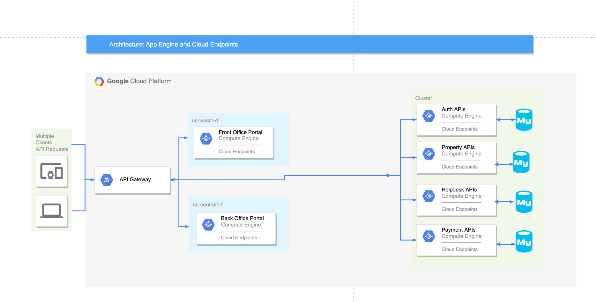

# AirBnb Clone

## Overview

Google Cloud Hosted Enterprise Application for an AirBnb Clone(without booking / date features). The application has a Front Office Portal for customers and a Back Office Portal for customer support.

## Technologies:

- Google Cloud Platform
- MySQL
- Java / Spring
- React.Js
- Docker
- Kubernetes
- Kong API Gateway
- Kubernetes Ingress
- JWT for Authentication

## Architechture Diagram

## Project Notes

### 1. Functional Requirements

#### Front Office Portal:

- A "Front Office" Web Application that allows customers to:

  - sign-up for accounts,
  - log-in to their account,
  - browse product catalog,
  - place, and pay for orders using credit cards.

#### Back Office Portals:

- A "Back Office" Web Applications that supports customers Queries

- The Back office also has its own backend Spring Boot Application that supports the following functionalities:

  - Viewing & Resolving Customer Queries

### 2. Technical Requirements

The application was implemented in Java Spring and be deployable as Docker Containers on Google Cloud VM's and/or Kubernetes Engine (GKE).

#### Software Stack & Tools

- **Must use Spring Framework (Spring MVC, Spring JPA):**

  - The app uses Spring Framework for **all backend application / services.**
  - For Back Office Portal(s)
  - For REST APIs

   

- Customer facing Front Office Portal:

  - Utilized **React.js** for Front Office Portal, and used Bootstrap & Material UI for styling components.

   

- **Development Tools**

  - Builds must be done with Gradle
  - Version of Java should be JDK 11
     

- **Database & Middleware Requirements**

  - **MySQL Database:** (MySQL database for persisting all data)
     
  - **RabbitMQ**
     
  - **Kong API Gateway:** Kong gateway is deployed on GKE ingress, and all services are exposed through the kong gateway.
     
  - **Credit Card Payments:** Support
    Integration with CyberSource Payment Gateway

### 3. Project Screenshots / Demo

#### Front Office Portal

1. Sign Up

   

     

2. Sign In

   

   

#### Back Office Portal

1. Auth Page

   

     

#### GCP Images

1. Workloads

   

    

2. GKE Services

   

    

3. GKE Ingress Details

   

    

4. GKE MySQL

   

    

